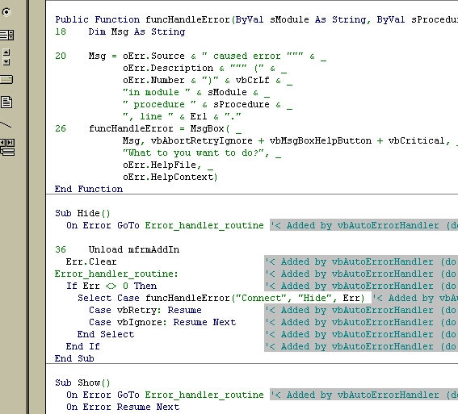



## Auto Error Trapper Addin

### Description

This code automatically adds centralized error trapping to your code. It reads an .ini file that it stores in the same folder as your project that contains two pieces of code. One is inserted into the top of every method and one is inserted in the bottom. This can be used as a last line of defense against unexpected errors. The default is to allow the user to Abort/Retry/Ignore the error instead of just crashing the program. It will also (optionally) automatically insert line number into your code so that you can use vb's Erl function to get the exact line number where your error occurred.

WARNING: This program directly modifies your code! Be sure to backup your code before using it. I am totally not responsible for any damage to your code.

Credit:

This was adapted from the program 'Auto Error Handler' by Nathan Dennis.
 
### More Info
 

             |
---                |---
**Submitted On**   |2003-06-02 08:25:30
**By**             |[Jason Stracner](https://github.com/Planet-Source-Code/PSCIndex/blob/master/ByAuthor/jason-stracner.md)
**Level**          |Intermediate
**User Rating**    |4.7 (28 globes from 6 users)
**Compatibility**  |VB 6\.0
**Category**       |[Coding Standards](https://github.com/Planet-Source-Code/PSCIndex/blob/master/ByCategory/coding-standards__1-43.md)
**World**          |[Visual Basic](https://github.com/Planet-Source-Code/PSCIndex/blob/master/ByWorld/visual-basic.md)
**Archive File**   |[Auto\_Error159567622003\.zip](https://github.com/Planet-Source-Code/jason-stracner-auto-error-trapper-addin__1-45826/archive/master.zip)

